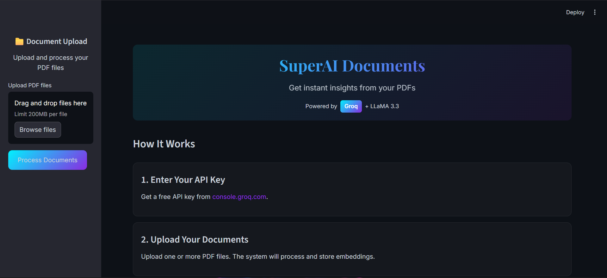
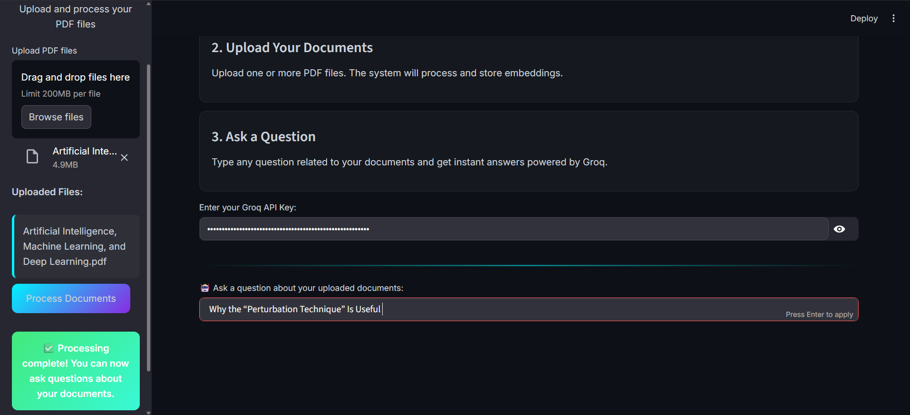
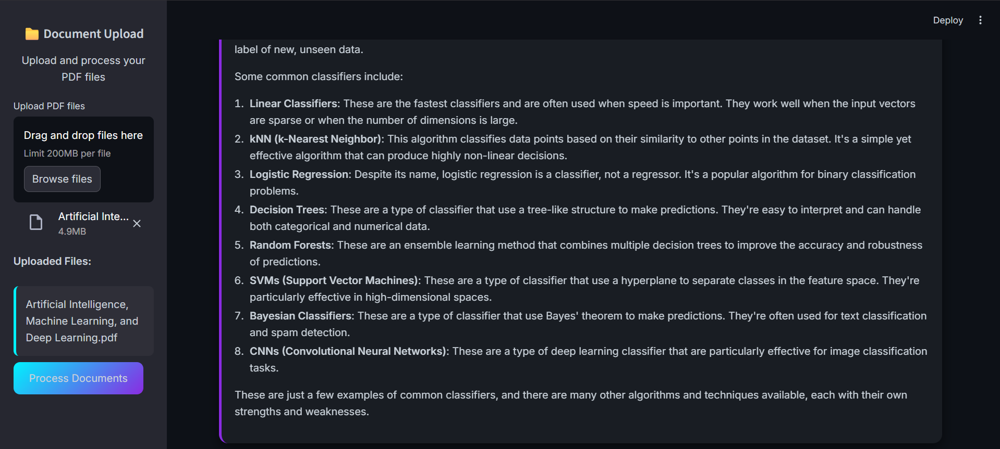

# SuperAI Document  
### AI-powered Insight Generator from PDFs using Groq & LLaMA 3.3

SuperAI Document is a powerful **Streamlit-based AI application** that allows users to upload PDF documents and ask natural language questions about their content.  
It uses a **Retrieval-Augmented Generation (RAG)** approach powered by **Groq’s ultra-fast inference** and **Meta’s LLaMA 3.3 model** to deliver accurate, context-aware answers.

---

## 🚀 Features

- **Instant PDF Insights** – Upload one or multiple PDFs and get answers instantly
- **RAG Architecture** – Combines vector search (FAISS) with LLM reasoning
- **Groq + LLaMA 3.3** – Ultra-fast inference using Groq’s LPU
- **Secure API Key Input** – API key is entered securely at runtime
- **Modern UI** – Clean, dark-themed Streamlit interface

---

## 🧠 How It Works (High Level)

1. PDFs are uploaded by the user
2. Text is extracted and split into chunks
3. Embeddings are generated using Sentence Transformers
4. FAISS stores the embeddings for similarity search
5. Relevant context is retrieved and sent to **LLaMA 3.3 via Groq**
6. The AI generates a precise answer based on the document content

---

## 🛠️ Tech Stack

- **Frontend**: Streamlit  
- **LLM**: LLaMA 3.3 (via Groq)  
- **Vector Store**: FAISS  
- **Embeddings**: Sentence Transformers  
- **PDF Processing**: PyPDF2  
- **Framework**: LangChain  

---

## ⚙️ Getting Started

### Prerequisites

- **Groq API Key**  
  Get your free API key from:  
  👉 https://console.groq.com/keys

- **Python 3.10** (recommended for FAISS compatibility)

---

## 🖼️ Screenshots

### Logo


### Home Page


### Upload PDFs


### AI Response




---

### Support

For issues, questions, or contributions, please refer to the GitHub repository issues section or submit a pull request.

## License

This project is licensed under the MIT License - see the LICENSE file for details.

### Working

Working link: https://ai-powered-insight-generator-from-pdfs-lycfxrx8axjq22e2xn4d9b.streamlit.app/

Run the App Locally:

```bash
streamlit run app.py


